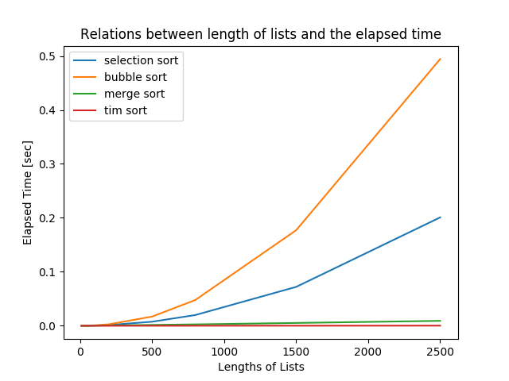

# CSFundamental 2nd homework

We will verify and give a consideration to time costs of 4 sorts(with their time orders) below.
- selection sort
  - $O(n^2)$
- bubble sort
  - $O(n^2)$ 
- merge sort
  - $O(n \log n)$ 
- tim sort
  - $O(n \log n)$ 

A figure of elapsed times by selection sort, bubble sort, merge sort, tim sort is shown below.

fig1. elepsed times by 4 sort algorighms

 
Looking at fig1. , As the time orders of 4 sorts, selection sort and bubble sort are much slower than other 2 sort algorithms as the length of lists increases.
  
Tim sort is slightly faster than merge sort at the length of list is 2500. So we conclude the fastest sort algorithm among 4 sort alogrithm is tim sort. (Of course it depends on the initial data order though.)
  
We give a consideration of why Tim sort is the fastest.  

#### Why tim sort is faster than selection sort and bubble sort?
Tim sort (and merge sort too) is a "divide and couquer" algorightm. In those algorithms, we divide the main problem into small problems, and then solve each small problems in a certain way. 
Intuitively, once we divide the sort problem into $n$ small sort problems where $n$ is the length of the list (it takes $O(\log n)$), each small problems take just $O(n)$. Consequently, total time cost is $O(n \log n)$.  
This is much faster than $O(n^2)$. For example, if $n = 1000000$, for $O(n \log n)$ algorithm iterates approximately $14000000$ calculations while $O(n^2)$ algorithm takes one trillion calculations. There is about $10^5$ difference between these time costs. That's why "divide and conquer" sorts are faster than the others.

#### Why tim sort is faster than merge sort?
The time orders of tim sort and merge sort are theoretically same. But in this experiment, tim sort is slightly faster than merge sort. 

Tim sort has good points of merge sort and quick sort.(Here we skip a explanation to quick sort.)  
Tim sort is intuitively the marge sort version of improvement of the quick sort.
Time orders of these sorts are shown below.

table1. Time Costs of Fast Sorting Algorithms

| Algorithm  | Average time  | Best time     | Worst time    |
| :--------- | :------------ | :------------ | :------------ |
| Merge sort | $O(n \log n)$ | $O(n \log n)$ | $O(n \log n)$ |
| Quick sort | $O(n \log n)$ | $O(n^2)$      | $O(n)$        |
| Tim sort   | $O(n \log n)$ | $O(n \log n)$ | $O(n)$        |

Looking at table1. , the best time and worst time of tim sort are both faster than the others. Tim sort sometimes takes the advantages while running the algorithm. The sort problem is divided into small problems as mentioned above. Some of the small problems could be worst cases for these sorts. In that case, tim sort is faster than merge sort. However, time costs of average case and best case are same. As a result, tim sort is slightly faster than merge sort.

Ref: [MathJax http://www.ic.daito.ac.jp/~mizutani/python/sort_algorithm.html](http://www.ic.daito.ac.jp/~mizutani/python/sort_algorithm.html)